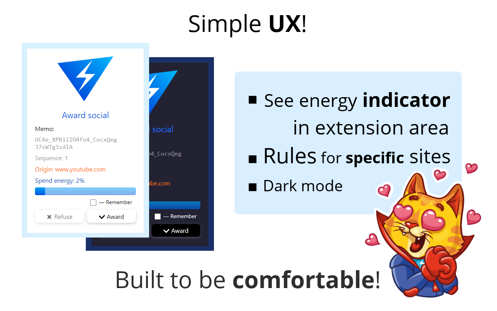

# Vizonator

Browser extension Vizonator include wallet for [VIZ blockchain](https://github.com/VIZ-Blockchain/viz-cpp-node) and web3 provider included as content script to active tab.

# Features

* Multi-account
* Wallet (history, transfer, stacking, unstacking, award)
* Rule-based trustline system for separate sites
* All data settings encoding by user password (AES-GCM: AES with Galois/Counter Mode)
* [Web3 Provider](https://viz.world/vizonator/docs/) like Metamask (`vizonator` global variable for js integrations)
* Integration with [Voice protocol](https://github.com/VIZ-Blockchain/Free-Speech-Project/blob/master/specification.md) (send post to account social feed)
* Integration with social gate `@social` ([read more about social gates](https://viz.world/social-gateways/))
* Dark-mode theme & Turbo cat as easter egg character

Social gate integration included as additional tool for easy way to reward content creators:

* Twitch.tv
* YouTube.com
* SoundCloud.com
* BitcoinTalk.org
* Github.com
* Reddit.com
* Twitter.com

> Some social gates can be disabled due API or site parsing restrictions.

## Dependencies

* [Cash js](https://github.com/fabiospampinato/cash/)
* [viz-js-lib](https://github.com/VIZ-Blockchain/viz-js-lib/)

## Distribution

Zip all files and upload archive as extension package to browser marketplace:

* [Chrome Web Store Developer Dashboard](https://chrome.google.com/webstore/devconsole/)
* [Firefox Browser Add-ons](https://addons.mozilla.org/)

> Some social gates can be disabled due API or site parsing restrictions.

Promo images with sources (GIMP file format) available in `screenshot` directory.

### Commentary for reviewers:

Extension using open source libraries: Cash min (from https://github.com/fabiospampinato/cash/) and viz-js-lib min (from https://github.com/VIZ-Blockchain/viz-js-lib/tree/master/doc).

Each minify version downloaded manually from github https://github.com/fabiospampinato/cash/releases/tag/8.1.5 or npm packages on latest version from jsdeliver https://cdn.jsdelivr.net/npm/viz-js-lib@latest/dist/viz.min.js