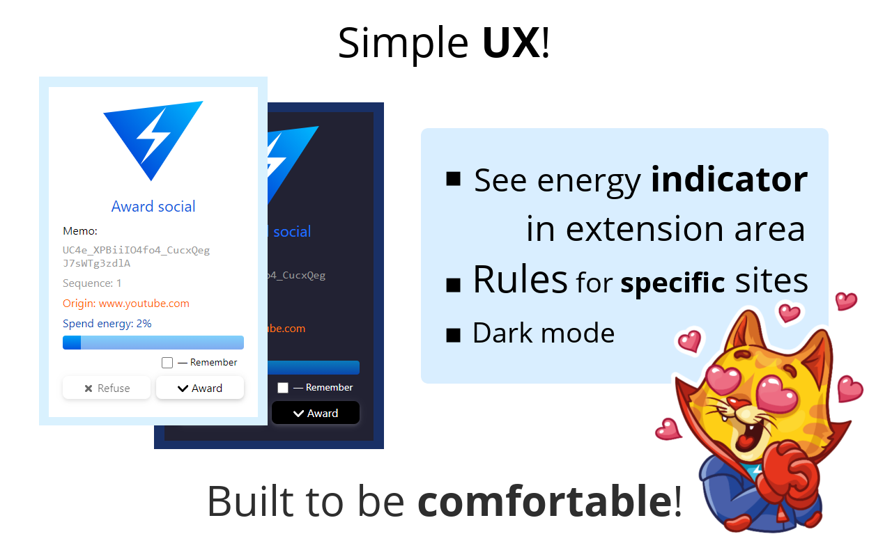

# Vizonator

Browser extension Vizonator include wallet for [VIZ blockchain](https://github.com/VIZ-Blockchain/viz-cpp-node) and web3 provider included as content script to active tab.



# Features

* Multi-account
* Wallet (history, transfer, stacking, unstacking, award)
* Rule-based trustline system for separate sites
* All data settings encoding by user password (AES-GCM: AES with Galois/Counter Mode)
* [Web3 Provider](https://viz.world/vizonator/docs/) like Metamask (`vizonator` global variable for js integrations)
* Integration with [Voice protocol](https://github.com/VIZ-Blockchain/Free-Speech-Project/blob/master/specification.md) (send post to account social feed)
* Integration with social gate `@social` ([read more about social gates](https://viz.world/social-gateways/))
* All [prediction market](https://viz-blockchain.github.io/viz-cpp-node/prediction-markets/) operations available to dApps (see below)
* Dark-mode theme & Turbo cat as easter egg character

Social gate integration included as additional tool for easy way to reward content creators:

* Twitch.tv
* YouTube.com
* SoundCloud.com
* BitcoinTalk.org
* Github.com
* Reddit.com
* Twitter.com

> Some social gates can be disabled due API or site parsing restrictions.

## Prediction market operations

All 23 broadcastable `pm_*` operations of the HF14 (Onix) hardfork are exposed to the page as
methods of the `vizonator` object. The account is never taken from the page: the extension signs
with the current user and only the operation fields come from the dApp.

```js
vizonator.pm_place_bet({market_id:268633,side:1,outcome_index:0,amount:'12.500 VIZ',min_tokens:9000},function(response){
	//response.error === false on success
});
```

Available: `pm_oracle_register`, `pm_oracle_update`, `pm_create_market`, `pm_oracle_accept_market`,
`pm_place_bet`, `pm_commit_bet`, `pm_reveal_bet`, `pm_cancel_bet`, `pm_add_liquidity`,
`pm_withdraw_liquidity`, `pm_resolve_market`, `pm_no_contest`, `pm_dispute_create`,
`pm_dispute_vote`, `pm_dispute_resolve`, `pm_dispute_oracle_respond`, `pm_unban`,
`pm_transfer_position`, `pm_lazy_deposit`, `pm_lazy_withdraw`, `pm_leverage_open`,
`pm_leverage_close`, `pm_leverage_convert`.

Every operation is signed with the active key, except `pm_dispute_vote` (regular key), and gets its
own trustline entry — approving one operation for a site does not approve the rest. Required fields
are checked before the confirmation window opens; an omitted optional field of `pm_oracle_update`
stays absent on the wire ("leave as is") instead of being sent as a zero.

The table of operations, their fields and authorities lives in a single file, `pm_ops.js`, shared by
the background, the page and the confirmation window.

## Dependencies

* [Cash js](https://github.com/fabiospampinato/cash/)
* [viz-js-lib](https://github.com/VIZ-Blockchain/viz-js-lib/)

## Distribution

Zip all files and upload archive as extension package to browser marketplace:

* [Chrome Web Store Developer Dashboard](https://chrome.google.com/webstore/devconsole/)
* [Firefox Browser Add-ons](https://addons.mozilla.org/)

> Some social gates can be disabled due API or site parsing restrictions.

Promo images with sources (GIMP file format) available in `screenshot` directory.

### Commentary for reviewers:

Extension using open source libraries: Cash min (from https://github.com/fabiospampinato/cash/) and viz-js-lib min (from https://github.com/VIZ-Blockchain/viz-js-lib/tree/master/doc).

Each minify version downloaded manually from github https://github.com/fabiospampinato/cash/releases/tag/8.1.5 or npm packages on latest version from jsdeliver https://cdn.jsdelivr.net/npm/viz-js-lib@latest/dist/viz.min.js